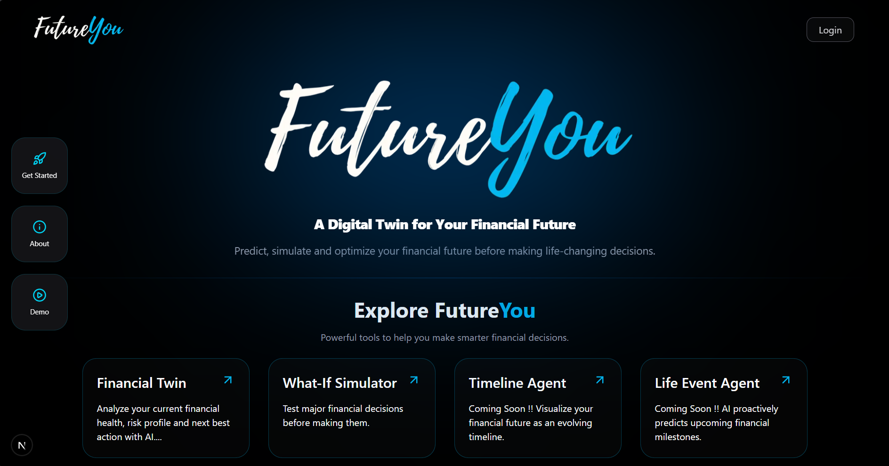
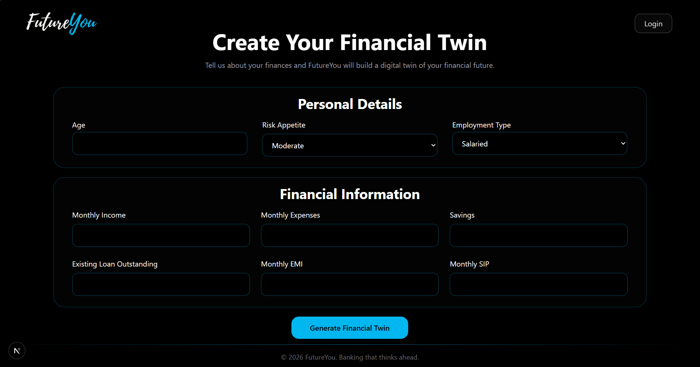

# FutureYou

### Banking that thinks ahead.

> **What if you could ask your future self before making life's biggest financial decisions?**

FutureYou is an AI-powered financial intelligence platform that builds a **Financial Digital Twin** of users and helps them understand the long-term consequences of financial decisions before they act.

Rather than reacting to financial events after they happen, FutureYou enables proactive decision-making through simulation, forecasting, and AI-powered guidance.

---






---

## The Problem

People make life-changing financial decisions every day:

* Should I buy a house?
* Can I afford this car?
* Am I saving enough for retirement?
* How will this loan affect my future?
* Should I wait before making this purchase?

Most people rely on spreadsheets, fragmented advice, online calculators, or intuition.

Traditional financial tools explain what happened in the past.

**FutureYou helps users understand what happens next.**

---

## Our Vision

FutureYou aims to become an intelligent financial companion that helps users navigate uncertainty through simulation, prediction, and AI.

By creating a living representation of a user's financial state—a **Financial Digital Twin**—the platform allows users to explore future scenarios before committing to important financial decisions.

> **Don't just track your finances. Understand your future.**

---

## Core Idea

FutureYou combines:

* Financial Modeling
* Scenario Simulation
* Agentic AI
* Predictive Intelligence
* Conversational Interfaces

to answer one fundamental question:

> **"If I make this decision today, what will my future look like?"**

---

# FutureYou v1

### Financial Twin + What-If Simulator

The first version focuses on helping users understand their current financial position and evaluate major decisions before acting.

---

## Financial Twin

Create a dynamic digital representation of a user's financial life.

### Inputs

* Age
* Monthly Income
* Monthly Expenses
* Savings
* Investments
* Existing Loans
* Monthly SIP
* Risk Appetite
* Financial Goals

### Outputs

* Financial Health Score
* Monthly Surplus
* Savings Rate
* Emergency Fund Analysis
* Risk Profile
* Goal Readiness Metrics

---

## What-If Simulator

Explore hypothetical decisions before making them.

### Supported Scenarios

* Home Purchase
* Loan Planning
* Investment Changes
* Expense Adjustments
* Goal-Based Forecasting

FutureYou evaluates:

* Monthly EMI burden
* Debt-to-income ratio
* Emergency fund adequacy
* Retirement impact
* Future affordability
* Financial resilience

and provides actionable recommendations.

---

## Current User Journey

```text
Create Financial Twin
          │
          ▼
View Financial Health
          │
          ▼
Run What-If Simulation
          │
          ▼
Receive Personalized Recommendation
```

---

# FutureYou v2

### Timeline Agent + Life Event Agent

FutureYou evolves from analysis into prediction.

---

## Timeline Agent

Visualizes a user's future financial journey.

### Example Timeline

```text
2026
Emergency Fund Completed

2028
Home Purchase Ready

2032
₹50L Wealth Milestone

2045
Retirement Ready
```

### Capabilities

* Future Wealth Forecasting
* Goal Achievement Tracking
* Retirement Readiness Projection
* Financial Milestone Visualization

---

## Life Event Agent

Proactively prepares users for major life events.

### Supported Events

* Home Purchase
* Marriage Planning
* Child Education
* Retirement Planning
* Major Lifestyle Changes

Instead of reacting to life events, FutureYou helps users prepare years in advance.

---

# FutureYou v3

### SBI Product Matching + Financial Knowledge RAG

FutureYou becomes an intelligent financial advisor powered by Retrieval-Augmented Generation.

---

## SBI Product Matching Agent

Maps user goals to relevant financial products.

### Examples

```text
Goal: Emergency Fund
↓
SBI Fixed Deposit

Goal: Retirement Planning
↓
SBI Mutual Funds

Goal: Home Purchase
↓
SBI Home Loan
```

---

## Financial Knowledge RAG Agent

A knowledge retrieval system built on:

* SBI Product Documentation
* Financial Education Resources
* Tax Rules
* Government Schemes
* Investment Knowledge
* Insurance Information

Users can ask:

> Should I choose an FD or SIP?

> How much emergency fund should I maintain?

> Which financial product suits my goal?

and receive grounded, context-aware responses.

---

# FutureYou v4

### Autonomous Financial Intelligence Platform

FutureYou evolves into a proactive AI financial ecosystem.

---

## Planned Agents

### Goal Navigator Agent

Tracks progress toward financial goals and identifies gaps.

### Risk Radar Agent

Monitors:

* Emergency Funds
* Debt Levels
* Savings Health
* Financial Stability

and proactively alerts users.

### Financial Coach Agent

Provides continuous personalized coaching and engagement.

### News Impact Agent

Analyzes economic events and explains their impact on the user's financial future.

### Multi-Agent Orchestration

FutureYou coordinates multiple specialized agents:

```text
Financial Twin Agent
What-If Agent
Timeline Agent
Life Event Agent
Risk Agent
Coach Agent
Knowledge Agent
```

through a central orchestration layer.

---

# System Architecture

```text
                 User
                   │
                   ▼
         Financial Profile
                   │
                   ▼
        Financial Digital Twin
                   │
                   ▼
         What-If Simulator
                   │
                   ▼
          Agentic AI Layer
                   │
      ┌────────────┼────────────┐
      ▼            ▼            ▼
 Timeline     Life Event      RAG
  Agent         Agent        Agent
      │            │            │
      └────────────┼────────────┘
                   ▼
         Recommendation Engine
                   │
                   ▼
            FutureYou Copilot
```

---

# Tech Stack

## Frontend

* Next.js
* TypeScript
* Tailwind CSS
* Framer Motion

## Backend

* FastAPI
* Python
* Pydantic

## AI Layer

* LangGraph
* LangChain
* Groq Llama Models

## RAG Infrastructure

* ChromaDB
* BGE Embeddings
* Sentence Transformers

## Data & Persistence

* PostgreSQL
* Redis (Future)

## Deployment

* Vercel
* Docker
* Railway / Render

---

# Repository Status

🚧 Active Development

Current Progress:

* Financial Twin Engine ✅
* Affordability Analysis ✅
* Home Purchase Simulation ✅
* Recommendation Engine ✅
* Dashboard UI 🚧
* Timeline Agent ⏳
* Life Event Agent ⏳
* RAG Agent ⏳

---

# Why FutureYou?

Financial decisions shape our future, yet most people make them without understanding their long-term consequences.

FutureYou combines simulation, prediction, and AI to help users make smarter financial decisions with confidence.

> **Don't ask what your finances look like today. Ask what they will look like tomorrow.**

---

## Disclaimer

FutureYou is intended for educational and decision-support purposes only and does not constitute financial advice. Users should consult qualified professionals before making major financial decisions.

---

## Built for Better Decisions

**FutureYou — Banking that thinks ahead.**

---

## Created By

### Shivam Pawar
